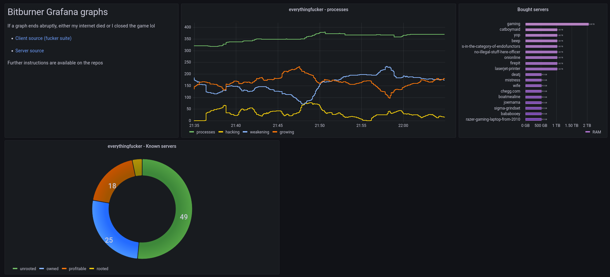

# bitburner-grafana

janky grafana integration for bitburner (specifically, [the fucker suite](https://github.com/oatmealine/bitburner-scripts/))

## prerequisites

- [PostgreSQL](https://www.postgresql.org/) >=v11.14
- [Grafana](https://grafana.com/) >=v8.3.3
- [Node.JS]() >=v16.11.1

## how

0. create a postgresql user and database:

```
$ sudo -s
$ su - postgres
$ psql
```
```
CREATE USER bitburner WITH PASSWORD 'passwordhere';
CREATE DATABASE bitburner OWNER bitburner;
```

1. clone the repository, `npm install` or `pnpm install`

2. copy `.env.example` to `.env`, edit the values as you feel fit

3. ensure the script works by trying out `node index.js` and going to `localhost:5252/bitburner` (you should see a `403`)

4. open your grafana setup, and create a new postgresql data source ([more info...](https://grafana.com/docs/grafana/latest/datasources/postgres/))

5. create a new dashboard, head to "JSON Model" in the settings, and paste in the contents of `grafana-dashboard.json`

6. you should be finished on the backend side!

7. (optionally) install pm2 and run this script with `pm2 start index.js --name bitburner-grafana`

follow the rest of the instructions on the [fucker suite gh page](https://github.com/oatmealine/bitburner-scripts/) - alternatively, here's how to manually send the information:

```js
const urlPrefix = 'https://localhost:3030/bitburner';

await ns.wget(`${urlPrefix}/?secret=${secret}&processes=5&hacking=2&growing=2&weakening=1`);

await ns.wget(`${urlPrefix}/servers?secret=${secret}&known=5&rooted=1&owned=1&profitable=3`);

await ns.wget(`${urlPrefix}/boughtserver?secret=${secret}&hostname=test&ram=16`);
await ns.wget(`${urlPrefix}/rmserver?secret=${secret}&hostname=test`);
```

## proof?

https://grafana.oat.zone/d/aelr2ZA7k/bitburner?orgId=1&refresh=5s&kiosk


